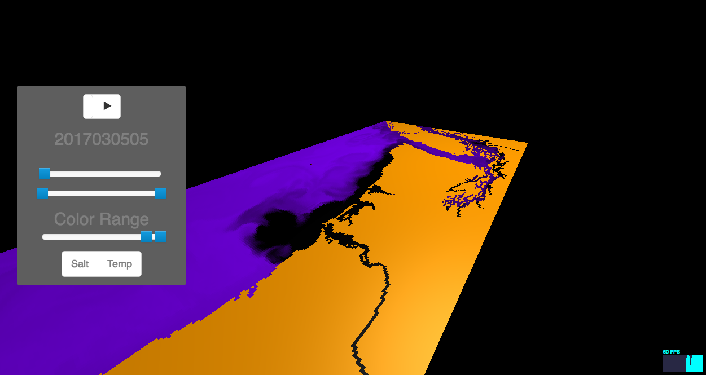

<h1 align="center">React Ocean App (under development)<h1/>

    

## Synopsis

A front-end Oceanography webapp built with React, Redux, and [React Three Renderer](https://github.com/toxicFork/react-three-renderer/). Meant to be served by the [Ocean App Server](https://github.com/hardinthepaints/ocean-app-server).

## Installation

1. Follow directions to install the [Ocean App Server](https://github.com/hardinthepaints/ocean-app-server). The instructions steps will download this repository as a submodule. 

## Usage

1. Choices:  
* Run the Ocean App Server and go to [http://localhost:5000/oceanapp/v1.0/app/static/react-ocean-app/build/index.html](http://localhost:5000/oceanapp/v1.0/app/static/react-ocean-app/build/index.html)  
* Run your own server to serve the files in /build

## Development
* Instructions for [Create React App](https://github.com/facebookincubator/create-react-app).
* `npm install`
* `npm start` and go to [http://localhost:3000/](http://localhost:3000/)
* Edit the files in [/src](/src)
* `npm run build` to build the files.

## Task List
- [ ] Snapshot tests for React components
- [ ] Make graph adhere to aspect ratio
- [ ] Layered 3d chart which shows shape of layers.
- [ ] Add streaming capability
- [ ] Pre-load frames
- [ ] Show frame data like hour or data
- [x] Frame scrubber should reflect range limit
- [ ] Frame scrubber should show which frames have loaded
- [x] Display loader spinner on not-yet-fetched frames
- [ ] Play toggle should be larger
- [ ] Add docs to explain code
- [ ] Terrain
- [ ] Controls page

## Notes
This project was bootstrapped with [Create React App](https://github.com/facebookincubator/create-react-app). The three-dimensional visualizer part of this app was created using [React Three Renderer](https://github.com/toxicFork/react-three-renderer/)

## License

MIT

